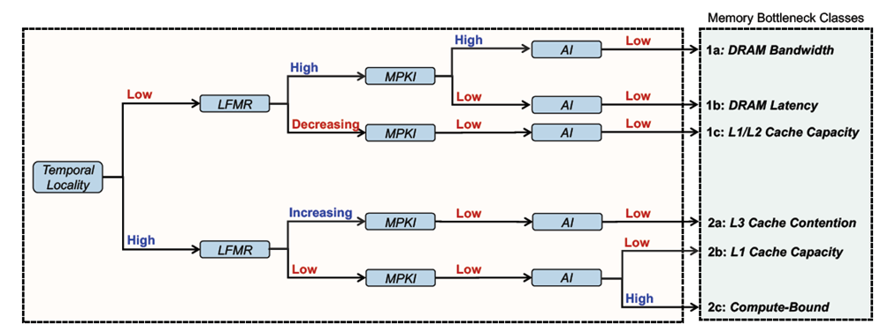

<table>
<tr>
<td>

# Agent-Based Simulations

**Performance characterization of large-scale agent-based simulations.**

This repository accompanies the ACACES 2026 poster:
> *"Understanding Performance Bottlenecks of Large-Scale Agent-Based Simulations"*
> Amina Sokoli · Dr. Abdullah Giray Yağlıkçı · CISPA Helmholtz Center for Information Security
</td>
<td align="right" valign="top">

&nbsp;&nbsp;

</td>
</tr>
</table>

---

## What this is

Agent-based simulations are growing in scale and complexity, yet their hardware performance characteristics remain poorly understood. *No* prior work rigorously and methodically investigates the performance bottlenecks that prevent agent-based simulations from scaling to multi-billions of agents efficiently.

This work presents the first rigorous, methodical evaluation of these bottlenecks, applying the [DAMOV methodology](https://github.com/CMU-SAFARI/DAMOV) to characterize data movement behavior at scale. We use [BioDynaMo](https://github.com/aminatpwk/biodynamo.git), the state-of-the-art agent-based simulation framework, running its epidemiology use case across agent counts from 10M to 200M on **Google Cloud Platform C4 VMs** (Intel Sapphire Rapids, 16-core, 64 GB RAM, Ubuntu 22.04 LTS).

---

## Key findings (poster)

| Metric | Observed range | Interpretation |
|---|---|---|
| LLC MPKI | 6–8  | Consistent LLC pressure; non-monotonic dip at 50M under investigation |
| Memory-bound fraction | >60% of pipeline slots | Memory latency is the dominant performance limiter, not compute throughput |
| IPC | 0.41–0.45 | Consistently low across all scales; pipeline stalls dominate |
| LFMR (L2\_MISS / L1\_MISS) | 0.74–0.80 | L2 cache is largely ineffective; most L1 misses escalate to main memory |

On Intel Sapphire Rapids, the L2 cache serves as the LLC. Together, these metrics place the workload in the **memory-bound region** of the DAMOV classification tree, motivating a more rigorous investigation into data movement as the primary scalability bottleneck in agent-based simulations.



Memory capacity is also a hard scalability wall: the 200M agent simulation consumed ~58 GB at peak (~290 bytes/agent), and simulations at 225M agents and beyond were terminated by the Linux OOM killer across all VM instances.

---

## Repository structure

```
acaces26-agent-based-modeling/
│
├── results/                          # Experimental output (per agent scale)
│   ├── 10million_agents/
│   │   ├── vm_run_01/                # One GCP VM run
│   │   │   └── analysis/
│   │   │       ├── parquet/          # Parsed perf data (one file per repetition)
│   │   │       ├── damov/            # DAMOV metrics: per_rep.csv, aggregate.csv, report
│   │   │       ├── within/           # Within-repetition variation (stats + time-series plots)
│   │   │       └── across/           # Across-repetition variation 
│   │   ├── vm_run_02/
│   │   └── vm_run_03/
│   ├── 50million_agents/
│   ├── 100million_agents/
│   └── 200million_agents/
│
├── scripts_for_experimental_runs/    # Infrastructure: provision, run, collect
│   ├── run_experiment.sh             # Master orchestrator
│   ├── _run_iteration.sh             # Per-run lifecycle: create VM → simulate → pull → destroy
│   ├── setup/
│   │   └── setup_env.sh              # VM setup: install BioDynaMo, build demo, verify PMU access
│   ├── simulation/
│   │   └── run_simulation.sh         # Launch perf stat + BioDynaMo inside tmux 
│   ├── transfer/
│   │   └── pull_results.sh           # Pull results from VM via tar-over-SSH with integrity gates
│   └── vm/
│       ├── create_vm.sh              # Provision C4 VM with PMU counters enabled
│       └── destroy_vm.sh             # Destroy VM only after transfer is verified
│
└── scripts_for_analysis/             # Analysis and figure generation
    ├── split_perf_repetitions.py     # Stream-split raw perf output into per-repetition files
    ├── README.md                     # Analysis pipeline documentation
    └── python_analysis/
        ├── parse_perf.py             # Parse .perf files → Parquet 
        ├── analyze_within.py         # Within-repetition stats, autocorrelation, trend, plots
        ├── analyze_across.py         # Across-repetition variation: Kruskal-Wallis, plots
        ├── analyze_damov.py          # DAMOV + Top-Down L2 characterization, threshold report
        └── generate_abstract_figures.py  # Poster/paper figures across all agent scales
```

---

## Experimental setup

**Hardware.** GCP C4 instances (`c4-standard-16`): 16-core Intel Sapphire Rapids, `hyperdisk-balanced`, `europe-west1-b`. PMU counters enabled via `--performance-monitoring-unit=standard`.

**Workload.** BioDynaMo's built-in epidemiology demo, configured at 10M, 50M, 100M, and 200M agents. Visualization disabled; OMP threads pinned to 16.

**Measurement.** `perf stat -I 1000` collecting 13 hardware events at 1-second intervals, across 3 VM runs × 10 repetitions per scale. 

**PMU events collected:**

```
instructions, cycles,
L2_RQSTS.MISS, L2_RQSTS.REFERENCES,
MEM_LOAD_COMPLETED.L1_MISS_ANY,
MEM_LOAD_RETIRED.{L1_HIT, L2_HIT, L1_MISS, L2_MISS},
TOPDOWN.{SLOTS_P, MEMORY_BOUND_SLOTS},
MEMORY_ACTIVITY.{STALLS_L1D_MISS, STALLS_L2_MISS}
```

**Derived metrics (DAMOV):**
- `LLC MPKI = L2_MISS × 1000 / instructions`
- `LFMR = L2_MISS / L1_MISS`
- `IPC = instructions / cycles`
- `Memory-bound fraction = MEMORY_BOUND_SLOTS / SLOTS_P`

---

## Analysis pipeline

Each `vm_run_NN/` directory has its own complete analysis. Run in order:

```bash
# 1. Split raw perf output into per-repetition files
python3 scripts_for_analysis/split_perf_repetitions.py <perf_file>

# 2. Parse .perf files into Parquet
python3 scripts_for_analysis/python_analysis/parse_perf.py \
    --in-dir results/<scale>/vm_run_NN/perf_splits/ \
    --out-dir results/<scale>/vm_run_NN/analysis/parquet/

# 3. Within-repetition variation
python3 scripts_for_analysis/python_analysis/analyze_within.py \
    --parquet-dir results/<scale>/vm_run_NN/analysis/parquet/

# 4. Across-repetition variation
python3 scripts_for_analysis/python_analysis/analyze_across.py \
    --parquet-dir results/<scale>/vm_run_NN/analysis/parquet/

# 5. DAMOV characterization
python3 scripts_for_analysis/python_analysis/analyze_damov.py \
    --parquet-dir results/<scale>/vm_run_NN/analysis/parquet/

# 6. Generate figures across all agent scales
python3 scripts_for_analysis/python_analysis/generate_abstract_figures.py \
    --root . --out figures/
```

---

## Reproducing experiments

> **Note:** Experiments require a GCP project with C4 quota in `europe-west1-b` and a BioDynaMo-compatible build environment. 

```bash
# Set required environment variables
export BIODYNAMO_LOCAL_HOST=<your-machine-ip>
export BIODYNAMO_LOCAL_USER=<your-username>
export BIODYNAMO_LOCAL_RESULTS_DIR=<local-results-path>
export BIODYNAMO_CALLBACK_KEY_PATH=~/.ssh/biodynamo_vm_callback

# Launch experiment (creates VM, runs simulation, pulls results, destroys VM)
bash scripts_for_experimental_runs/run_experiment.sh
```

The orchestrator provisions a fresh C4 VM per run, uploads scripts, launches BioDynaMo under `perf stat` in a detached `tmux` session, polls for completion, pulls results via `tar`-over-SSH, and destroys the VM only after integrity checks pass.

---

## Dependencies

**Analysis scripts:** Python 3.10+, `pandas`, `numpy`, `scipy`, `matplotlib`, `pyarrow`

**Experiments:** `gcloud` CLI, `tmux`, BioDynaMo (installed automatically by `setup_env.sh`), Linux `perf`

---

## Methodology notes

- **Perf time-multiplexing.** With 13 events and limited counter slots, the kernel time-multiplexes. Coverage percentages are recorded per tick; derived ratios (IPC, LFMR, etc.) cancel multiplexing bias without adjustment.
- **LFMR** Observed at some agent scales; attributed to hardware prefetcher inflation of `L1_MISS` counts. 
- **50M agent anomaly.** A non-monotonic performance dip at 50M agents is documented but its cause is deferred to future work.
- **NUMA utilization.** Simulations ran on a single NUMA node of a four-node system. Full NUMA utilization is an open question for follow-up.

---

## Citation

If you use this repository or build on these results, please cite the ACACES 2026 poster (citation details to be added upon publication).

---

## Contact

**Amina Sokoli** 

Linkedin: [Amina Sokoli](https://www.linkedin.com/in/amina-sokoli-a34554247/)

GitHub: [@aminatpwk](https://github.com/aminatpwk)  
